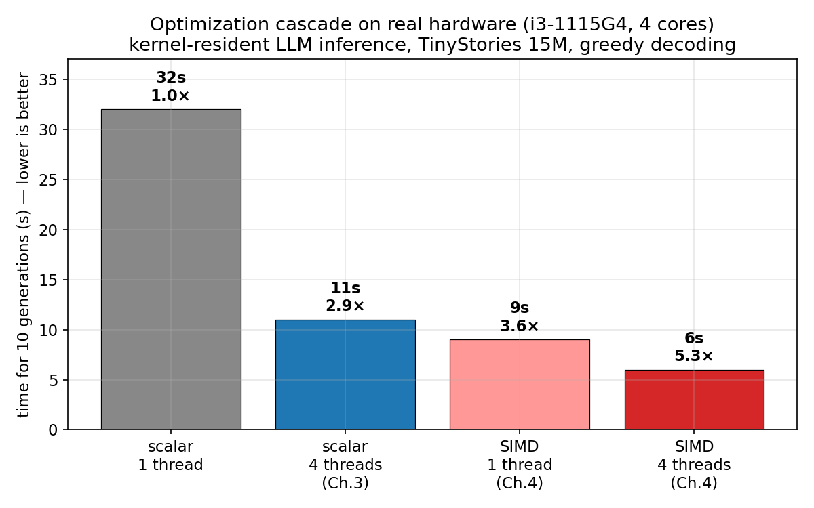
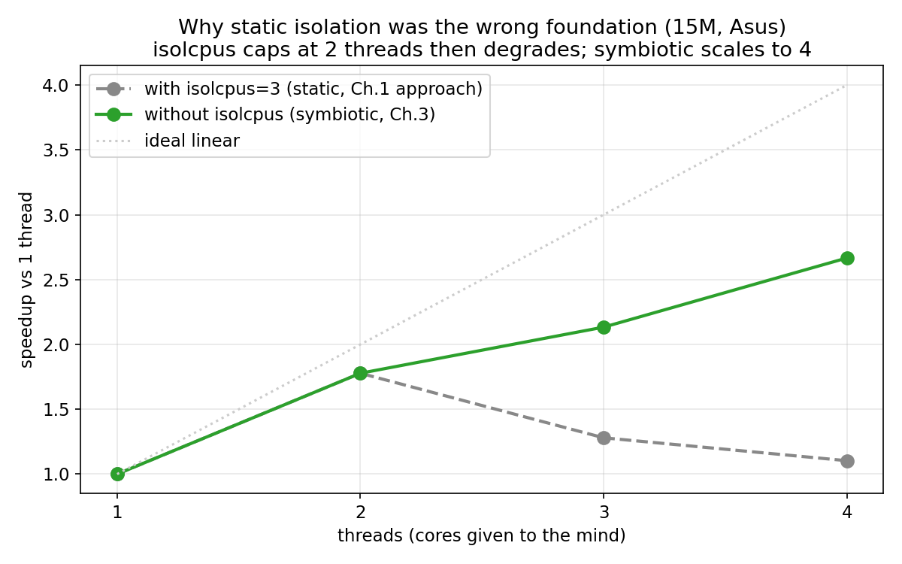
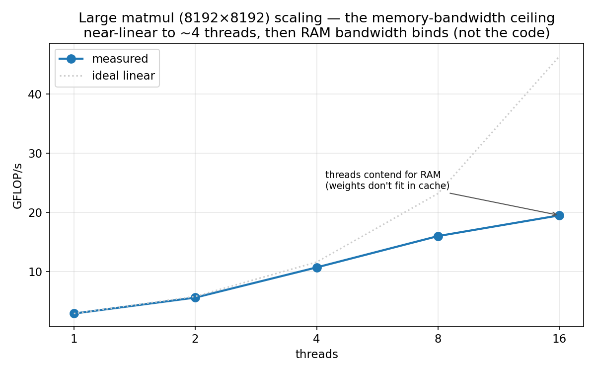
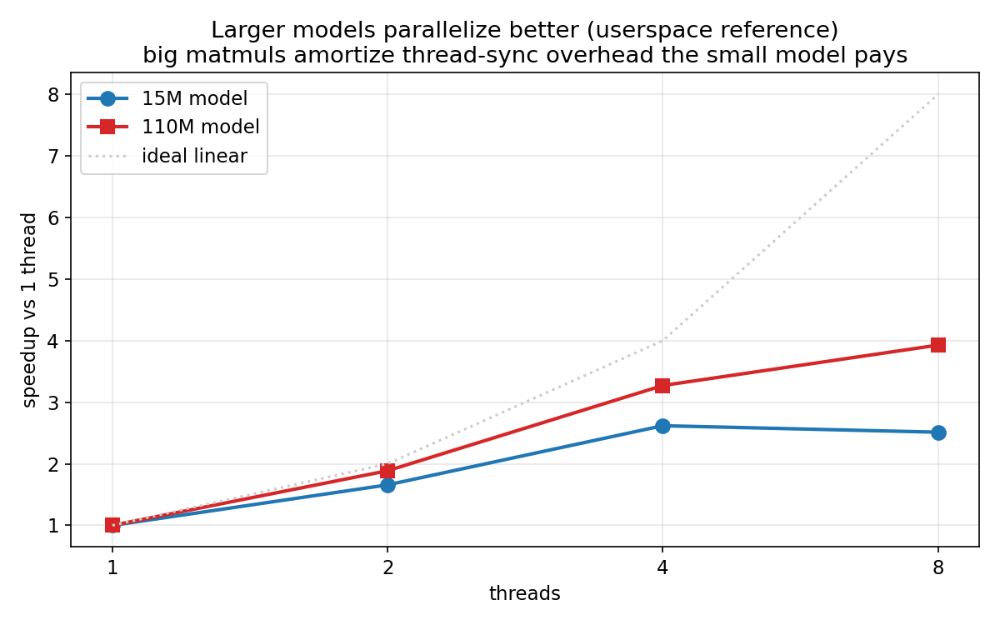

# Benchmarks

All figures below are generated from the real measurements reported across
the chapters (script: `make_benchmarks.py`), not illustrative. Hardware
unless noted: the deployment target, an Intel i3-1115G4 (Tiger Lake, 4
cores, AVX2+FMA), running the kernel-resident engine on the TinyStories 15M
Llama2 checkpoint with greedy decoding, timed over ten full 256-token
generations per configuration.

## The optimization cascade

The headline result: the same kernel-resident inference, from the scalar
single-threaded baseline (Chapter 2) through symbiotic multi-core (Chapter 3)
and vectorization (Chapter 4). Each stage is a real measurement on the same
hardware. End to end, **5.3× faster** than the scalar serial baseline, output
byte-identical, zero crashes. Note that SIMD on a single core (9 s) already
beats scalar on all four cores (11 s).

## Why static isolation was the wrong foundation

Chapter 1 dedicated a core with `isolcpus`. Chapter 3 abandoned that for a
symbiotic model (threads on shared cores, scheduler decides). This is the
direct evidence for the switch: with `isolcpus=3` only three cores are
schedulable, so scaling peaks at 2 threads and then *degrades* as a fourth
thread oversubscribes them; removing `isolcpus` lets all four cores
participate and scaling grows monotonically. The static-isolation
configuration actively conflicts with the goal of letting the mind's
resource use grow.

## The memory-bandwidth ceiling

A synthetic large matrix multiplication (8192×8192, the scale of a
billion-parameter model's layer) scales near-linearly to about 4 threads and
then flattens. The flattening is not a defect of the parallelization — it is
memory bandwidth: the weight matrix does not fit in cache, so the threads
contend for RAM. This is the physical ceiling that bounds large-model
inference on bandwidth-limited hardware, and the reason quantization (smaller
weights) is on the roadmap alongside more cores.

## Larger models parallelize better

Userspace reference (identical partition logic, pthread pool) comparing the
15M and 110M models. The larger model scales better: its matrix
multiplications are big enough to amortize the per-matmul thread-
synchronization overhead that the small model's tiny matmuls spend a large
fraction of their time paying. The multi-core mechanism is aimed at large
models; on small ones it is merely not harmful.
